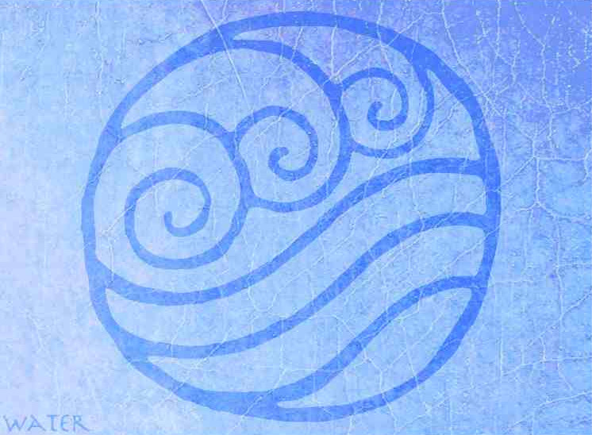
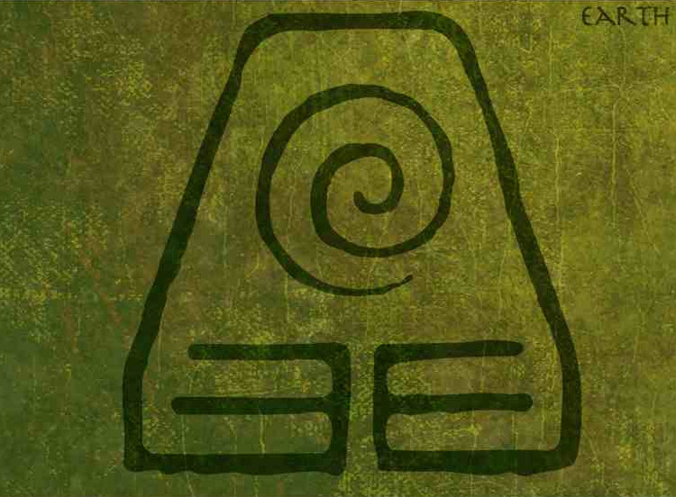
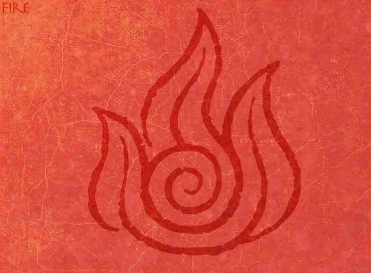
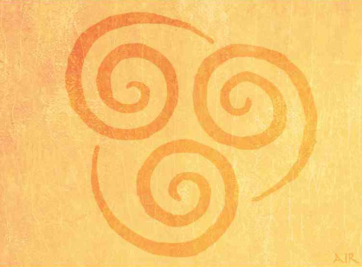

#### Introduction

I, admittedly, am not using this repository as it's intended to be used. Regardless, I
definitely leverage the psychological motivation that GitHub's contribution
tracker provides, so I have continued to attempt to push most learning related
tasks or content here.

I find David Deutsch's arguments (from [_The Fabric of
Reality_](https://en.wikipedia.org/wiki/The_Fabric_of_Reality) and [_The
Beginning of
Infinity_](https://en.wikipedia.org/wiki/The_Beginning_of_Infinity)) well
reasoned, so I have created an architectural scheme to organize my
interests that plays on arguments from his first book, a favorite show
of mine, and a nod to ancient philosophy in general.

<kbd>
  computation
    
  
</kbd>
<kbd>
  evolution
    
  
</kbd>
<kbd>
  mathematics
    
  
</kbd>
<kbd>
  epistemology
    
  
</kbd>

Note: my attention is focused on mathematics and programming at the
moment&mdash;I will revisit content related to biology and philosophy and at
some point (maybe).

<h1 align="center">🏛️ University Resources 🏛️</h1>

<kbd>
  
</kbd>

<h2 align="center">❄️  Winter 2022 ❄️</h2>

<table align="center">
  <tr>
    <td align="center"><strong><a href="water/python/mth-371/">mathematical computing</a></strong></td>
    <td align="center"><strong><a href="fire/statstics/stat-361/">staistical   methods</a></strong></td>
  </tr>
  <tr>
    <td align="center"></td>
    <td align="center"></td>
  </tr>
  <tr>
    <td align="center"><strong><a href="water/python/mth-371/">MTH: 371</a></strong></td>
    <td align="center"><strong><a href="fire/statistics/stat-361/">STAT: 361</a></strong></td>
  </tr>
</table>

 

<table align="center">
  <tr>
    <th>
      <h3 align="center">🎓 Prior Notes 🎓 </h2>
    </th>
  </tr>
  <tr>
    <td>
      

         
        
      

    </td>
  </tr>
  <tr>
    <td>
      

         
        <a href="http://raw.githubusercontent.com/nosvagor/notes/master/.assets/prior/ch-335.pdf">📓 <strong>Organic Chemistry II</strong>
        </a>
         
        <a href="http://raw.githubusercontent.com/nosvagor/notes/master/.assets/prior/mth-261.pdf"> 📓 <strong>Linear Algebra</strong>
        </a>
        &nbsp;
        <a href="http://raw.githubusercontent.com/nosvagor/notes/master/.assets/prior/statistics.pdf">📓 <strong>Statistics</strong>
        </a>
      

    </td>
  </tr>
</table>
