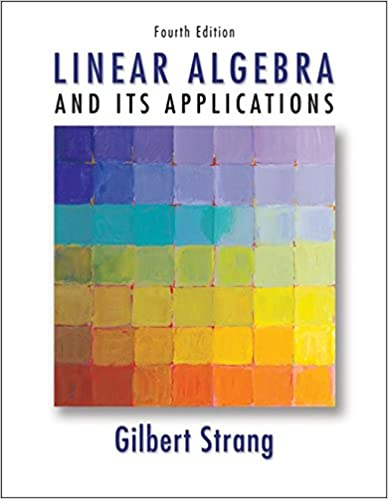

  <kbd>
    
  </kbd>

## Resources
- [Syllabus](syllabus.pdf)
- [Applied Linear Algebra](https://book4you.org/book/954299/ecb05c)
  - Main source (possibly only source) of exercises.
- [Essence of Linear Algebra](https://youtube.com/playlist?list=PLZHQObOWTQDPD3MizzM2xVFitgF8hE_ab)
  - An excellent series Created by Grant Sanderson (3blue1Brown).
- [**Linear Algebra Notes**](https://raw.githubusercontent.com/nosvagor/notes/master/assets/prior/mth-261.pdf)
  - MTH 261: previous, spring 2021
- [**Applied Linear Algebra Exercises**](https://raw.githubusercontent.com/nosvagor/notes/main/fire/linear/mth-343/applied-linear.pdf)
  - MTH 343: current WIP

## Exercises (python)
- [1 Matrices and Gaussian Elimination](matrices.py)
- [2 Vector Spaces](vectorSpaces.py)
- [3 Orthogonality](orthogonality.py)

Note: I avoid using python in problems after chapter 3, instead focusing on
proof related problems.
