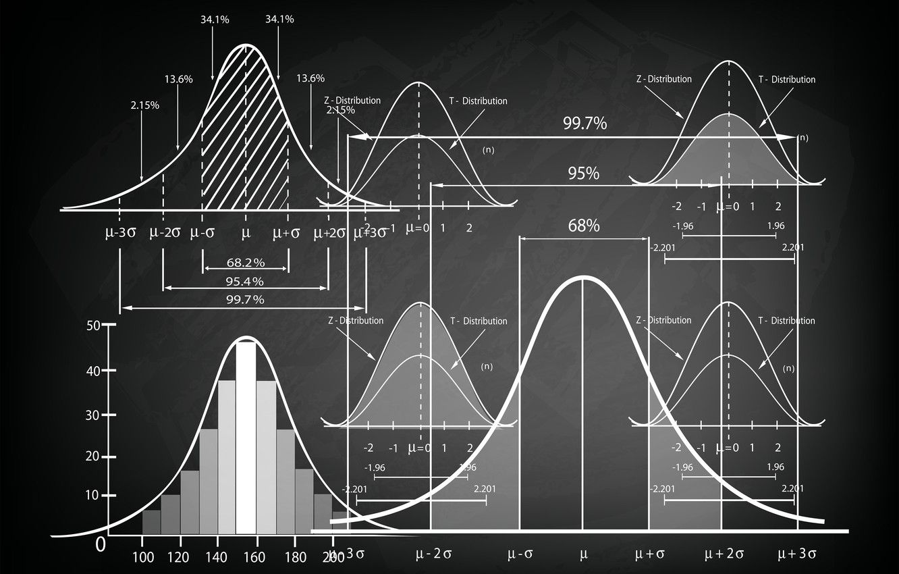

# Statistics

  <kbd>
    
  </kbd>

## Resources

- [**Statistics** for Machine Learning w/ code by **Mike X Cohen**](https://www.udemy.com/course/statsml_x/) &rarr; completed 🏆
  - [📑 statistics notes v1](http://raw.githubusercontent.com/nosvagor/notes/main/assets/prior/statistics.pdf) &rarr; done 🏫

## Exercises

- [Udemy](/python/statistics/udemy) &rarr; completed 🏆
