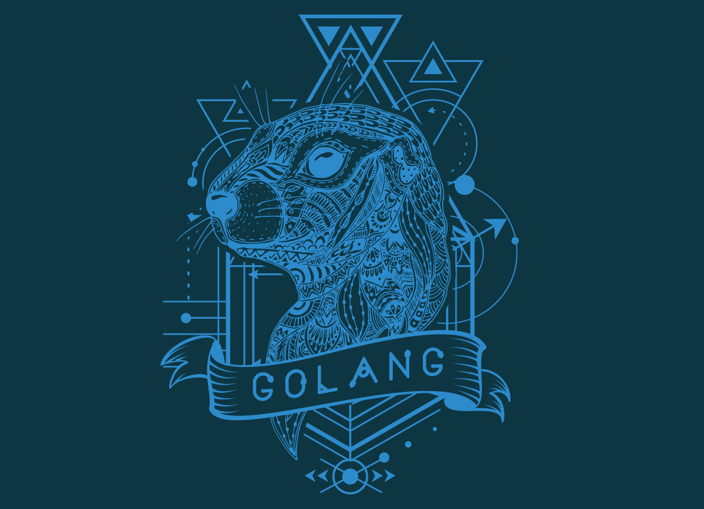

# Go

  <kbd>
    
  </kbd>

## **Course Materials**

- [A comprehensive **Go** course by **Todd McLeod**](https://www.udemy.com/course/learn-how-to-code/) &rarr; completed 🏆
  - [Course outline](https://docs.google.com/document/d/1ckYpi6hcRkaBUEk975f54oGsHYHu7GhzOk7-nOrkNxo/edit)
  - [Course resources](https://github.com/GoesToEleven/go-programming)
- [Web Development w/ **Go** by **Todd McLeod**](https://www.udemy.com/course/go-programming-language/) &rarr; in progress ⏳
  - [Course resources](https://github.com/GoesToEleven/golang-web-dev)

## Exercises

- [codewars content](/water/golang/exercises)
