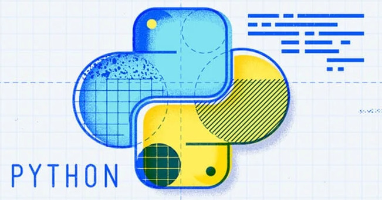

# Python

  <kbd>
    
  </kbd>

## [Pandas](fire/python/pandas)

- [Pandas bootcamp by Alexander Hagmann](https://www.udemy.com/course/the-pandas-bootcamp/) &rarr; in progress ⏳

 

## [Linear Algebra](fire/python/linear)

- [Linear algebra assignments (MTH 261, PSU)](water/python/mth-261) &rarr; completed 🏆
  - [📑 Relevant notes](http://raw.githubusercontent.com/nosvagor/notes/main/assets/prior/mth-261.pdf) &rarr; v1, done 🏫
- [Applied linear algebra assignments (MTH 343, PSU)](water/python/mth-343) &rarr; in progress ⏳

 

## [Statistics](fire/python/statistics)

- [Statistics for Machine Learning w/ code by Mike X Cohen](https://www.udemy.com/course/statsml_x/) &rarr; completed 🏆
  - [📑 Relevant notes](http://raw.githubusercontent.com/nosvagor/notes/main/assets/prior/statistics.pdf) &rarr; v1, done 🏫
  - [Exercises](fire/python/statistics/udemy)

 

## [Calculus](fire/python/calculus)

- [📑 Relevant notes](http://raw.githubusercontent.com/nosvagor/notes/main/fire/calculus/calculus.pdf) &rarr; v2, work in progress 🏗
- [Calculus III (MTH 253, PSU)](water/python/calculus/mth-253) &rarr; in progress ⏳
